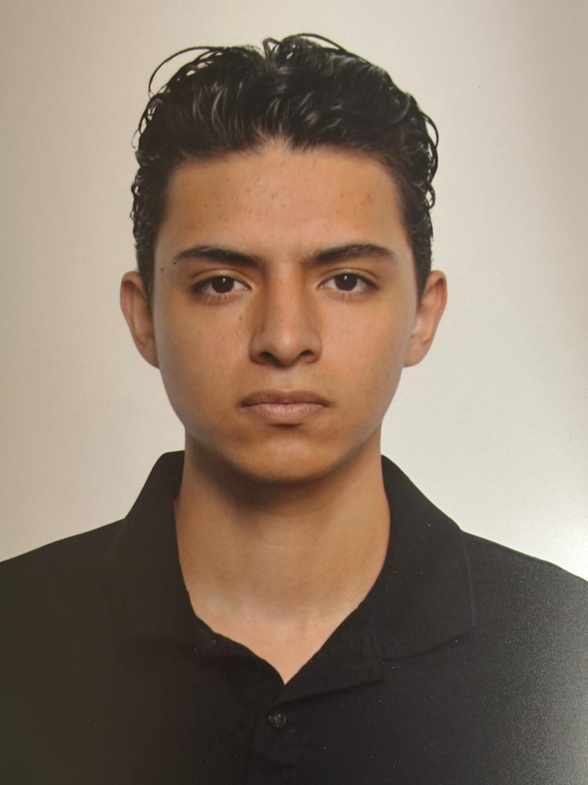

  
  <h1>David Fernando Lopez Alanis</h1>
  
<strong>Undergraduate student in Computer Technologies Engineering at Universidad de Monterrey (UDEM)</strong>

  
UX/UI designer passionate about human-centered design and front-end development.

  

    <a href="mailto:david.lopeza@udem.edu">david.lopeza@udem.edu</a> · 
    <a href="https://github.com/davidlopeza">GitHub</a> · 
    <a href="https://www.linkedin.com/in/davidlopeza">LinkedIn</a>
  

---

## About Me

I am an undergraduate student in Computer Technologies Engineering at the Universidad de Monterrey (UDEM).  
My work focuses on user-centered design, front-end development, and the intersection between technology and human experience.  

I have one year of experience in UX/UI design at Fe de Nuevo León Foundation, where I contributed to improving digital accessibility and visual design consistency.  
Beyond that, I have built mobile applications and websites for academic and collaborative projects, always aiming to create intuitive and meaningful digital experiences.

---

## Education

**Universidad de Monterrey (UDEM)**  
B.S. in Computer Technologies Engineering  
Monterrey, Mexico  
(Expected graduation: December 2026)  

---

## Experience

**UX/UI Designer — Fe de Nuevo León Foundation**  
2023 – 2024  
- Redesigned and maintained the foundation’s website using HTML and CSS, improving responsiveness and structure.  
- Conducted usability tests and contributed to accessible interface improvements.  
- Collaborated with multidisciplinary teams to enhance user experience and design cohesion.  

**Front-End Developer — Academic Projects**  
2022 – Present  
- Developed a data visualization website for a Swedish museum showcasing migration statistics and analysis.  
- Created a mobile app prototype to help parents monitor their children’s academic, emotional, and mental progress.  
- Worked on multiple group projects emphasizing collaboration, creativity, and design thinking.

---

## International Collaboration

**COIL Program — Collaborative Online International Learning**  
UDEM with students from Africa and China  
- Participated in cross-cultural design teams to create innovative user interface concepts and digital experiences.  

---

## Skills

- Programming: C++, HTML, JavaScript, SQL  
- Operating Systems: Linux, Windows  
- Design: UX/UI Design, Prototyping, Responsive Layouts  
- Tools: Figma, VS Code, Git, GitHub  
- Languages: Spanish (Native), English (C1)

---

## Volunteer Experience

**Elderly Care Volunteer — Christmas Season**  
Organized and participated in a holiday event at a nursing home, preparing gifts and activities to bring joy and companionship to the residents.
